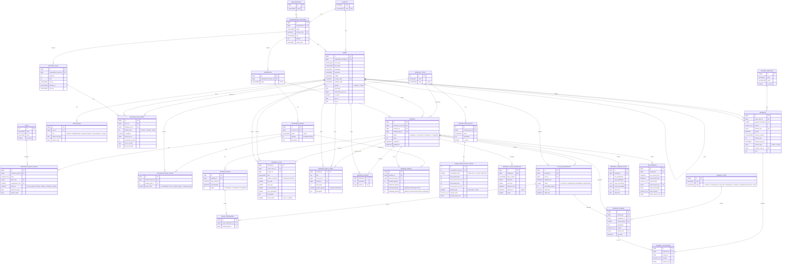

```mermaid

erDiagram

    COUNTRY{
        varchar(2) code
        varchar(100) name "i18n"
    }

    ORGANIZATIONS {
        bigint id PK
        varchar(200) name
    }

       ORGANIZATION_LOCATIONS {
        bigint id PK
        bigint organization_id FK
        varchar(200) name
        varchar(2) country_code FK
        varchar(200) city
        text address
        varchar(50) postal_code
    }

    RESOURCES {
        bigint id PK
        bigint organization_location_id FK
        varchar(200) name "* i18n *"
    }
    RESOURCE_ASSETS{
        bigint id PK
        bigint resource_id FK
        varchar(200) name "* i18n *"
        int quantity "Available quantity"
        text description
    }
    RESOURCE_ASSET_PRICES{
        bigint id PK
        bigint resource_asset_id FK
        numeric_12_2 price
        tinyint price_unit FK
        smallint measurment_unit FK
        smallint price_for " 1=per_booking ,2=hourly ,3=daily , 4=monthly ,5=yearly"
        date valid_from_date
        date valid_to_date
    }
    BOOKING_TYPES{
        int id PK
        varchar(50) code
        varchar(200) name "* i18n *"
    }
    RESOURCE_ASSET_RULES {
         bigint id PK
         bigint resource_asset_id FK
         int booking_type_id FK
         smallint asset_mode "1=unavailable, 2=free, 3=optional_paid , 4=required_paid "
    }
    USERS{
        bigint id PK
        bigint organization_location_id FK
        varchar(100) first_name
        varchar(100) last_name
        varchar(50) username
        varchar(50) password
        varchar(11) mobile
        varchar(2) country_code FK
        varchar(10) national_code
        int gender "1=female , 2=male"
        date birth_date
        bigint referred_by_user_id
        boolean is_active
        date join_at
        date left_at
    }
    USER_ROLES{
        bigint id PK
        bigint user_id FK
        int role "1=admin ,2=boardmember ,3=guard ,4=janitor , 5=accountment , 6=coach"
        date valid_from_date
        date valid_to_date
    }
    BUILDING_UNIT_USERS{
        bigint id PK
        bigint user_id FK
        bigint building_unit_id FK
        int relation_type "1=owner , 2=tenant , Guest "
        boolean is_resident
        bigint head_user_id
        int ownership_percent
        date move_in_date
        date move_out_date
    }
    BUILDING_UNITS{
        bigint id PK
        bigint organization_location_id FK
        int staircase
        int floor
        varchar(100) unit_no
        varchar(100) parking_no
        varchar(100) store_no
    }
    UNITS{
        int id PK
        varchar(20) code
        varchar(50) name
        boolean is_active
    }
    BOOKING{
        bigint id PK
        bigint created_by_user_id FK
        bigint resource_id FK
        bigint booking_type_id FK
        int status "1=pending , 2=confirmed ,3=cancelled , 4=completed"
        text notes
        datetime2 created_at
        datetime2 updated_at
    }
    BOOKING_DATES{
        bigint id PK
        bigint booking_id FK
        datetime2 start_datetime
        datetime2 end_datetime
        int status "1=scheduled , 2=cancelled ,3=completed "

    }
     BOOKING_CLASS{
        bigint booking_id FK "PK"
        bigint coach_user_id FK
        bigint booker_id FK
        varchar(200) title
        smallint gender_restriction "1-femail,2-mail,3-both"
        smallint min_age
        smallint max_age
        smallint min_participants
        smallint max_participants
        text description
        smallint class_mode "1-term ,2- flexable"

     }
     BOOKING_PARTY_EVENT{
        bigint booking_id FK "PK"
        text title
        bigint host_user_id FK
        bigint booker_id FK
        int max_qusts
        smallint gender_guests "1-femail,2-mail,3-both"
        text description

     }

     BOOKING_PRIVATE{
        bigint booking_id FK "PK"
        text description
        bigint booker_id FK
     }

     BOOKING_ASSETS{
        bigint id PK
        bigint booking_id FK
        bigint resource_asset_id FK
        int booked_quantity
        int delivered_quantity
        int returned_quantity "Quantity received upon return"
        int damaged_quantity "Quantity of returned items that are damaged"
     }

     CANCELLATION_POLICY{
        int id PK
        bigint booking_type_id FK
        varchar(100) name
        text description
        boolean is_active
     }
     CANCELLATION_POLICY_RULES{
        int id PK
        int cancellation_policy_id FK
        smallint cancellation_type "1-befor start , 2-at start 3-after start"
        int time_period_start
        int time_period_start_unit FK
        int time_period_end
        int time_period_end_unit FK
        smallint penalty_type "1-percently , 2-fixed"
        numeric_12_2 penalty_value
        tinyint penalty_value_unit FK
     }

     BOOKING_CLASS_SCHEDULES{
        bigint id PK
        bigint booking_id FK
        varchar(50) day_of_week
        time(5) start_time
        time(5) end_time
        datetime2 effective_from
        datetime2 effective_to "nullable"
        smallint status
     }

     CLASS_REGISTRATION{
        bigint id PK
        bigint booking_id FK
        bigint user_id FK
        datetime2 registered_at
        smallint status "1-ACTIVE ,2-CANCELLED,3-EXPIRED,4-COMPLETED"
        int purchased_session
        datetime2 valid_from
        datetime2 valid_until
     }

     CLASS_ATTENDANCE{
        bigint id PK
        bigint class_registration_id FK
        bigint booking_date_id FK
     }

     CHARGE_TYPES{
        smallint id pk
        varchar(50) code
        varchar(200) name "1-class fee, 2-booking-fee, 3-asset fee ,4-damage fee ,5-deposit ,6-settlement with tower,7-other "
     }
     PAYMENT_METHODS{
        smallint id PK
        varchar(50) code
        varchar(100) name
        boolean is_active
     }
     BOOKING_CHARGE{
        bigint id PK
        bigint booking_id FK
        bigint registration_id FK
        smallint charge_type_id FK
        text description
        numeric_12_2 amount
        tinyint amount_unit FK
        datetime2 due_date
     }
     PAYMENTS{
        bigint id PK
        bigint Payer_user_id FK
        smallint payment_method_id FK
        numeric_12_2 amount
         tinyint amount_unit FK
        datetime2 paid_at
        nvarchar(100) refrence_number
        file refrence_file
        varchar(50) refrence_file_type
        tinyint receiver_type "1-tower ,2-coach"
        bigint receiver_user_id FK
        text note
     }
     PAYMENT_ALLOCATIONS{
        bigint id PK
        bigint payment_id FK
        bigint charge_id FK
        numeric_12_2 amount
         tinyint amount_unit FK
     }
     BOOKING_CHARGE_RULES{
        bigint id PK
        bigint booking_id FK
        int min_participants
        int max_participants
        tinyint tower_percentage
        tinyint coach_percentage
        date valid_from
        date valid_until
     }
     SETTLEMENTS{
        bigint id PK
        bigint booking_id FK
        datetime2 time_period_from
        datetime2 time_period_until
        numeric_12_2 total_amount
        tinyint total_amount_unit FK
        tinyint tower_percentage
        numeric_12_2 tower_amount
        tinyint tower_amount_unit FK

     }


COUNTRY ||--o{ ORGANIZATION_LOCATIONS : has
    COUNTRY ||--o{ USERS : has

    ORGANIZATIONS ||--o{ ORGANIZATION_LOCATIONS : has

    ORGANIZATION_LOCATIONS ||--o{ RESOURCES : contains
    ORGANIZATION_LOCATIONS ||--o{ USERS : has
    ORGANIZATION_LOCATIONS ||--o{ BUILDING_UNITS : contains

    RESOURCES ||--o{ RESOURCE_ASSETS : has

    RESOURCE_ASSETS ||--o{ RESOURCE_ASSET_PRICES : has
    RESOURCE_ASSETS ||--o{ RESOURCE_ASSET_RULES : has
    RESOURCE_ASSETS ||--o{ BOOKING_ASSETS : booked_as

    BOOKING_TYPES ||--o{ RESOURCE_ASSET_RULES : defines
    BOOKING_TYPES ||--o{ BOOKING : categorizes
    BOOKING_TYPES ||--o{ CANCELLATION_POLICY : has

    USERS ||--o{ USERS : refers
    USERS ||--o{ USER_ROLES : has
    USERS ||--o{ BUILDING_UNIT_USERS : assigned_to
    USERS ||--o{ BUILDING_UNIT_USERS : heads

    BUILDING_UNITS ||--o{ BUILDING_UNIT_USERS : has

    USERS ||--o{ BOOKING : creates
    RESOURCES ||--o{ BOOKING : reserved_for

    BOOKING ||--o{ BOOKING_DATES : has
    BOOKING ||--o| BOOKING_CLASS : is_class
    BOOKING ||--o| BOOKING_PARTY_EVENT : is_party_event
    BOOKING ||--o| BOOKING_PRIVATE : is_private

    USERS ||--o{ BOOKING_CLASS : coaches
    USERS ||--o{ BOOKING_CLASS : books
    USERS ||--o{ BOOKING_PARTY_EVENT : hosts
    USERS ||--o{ BOOKING_PARTY_EVENT : books
    USERS ||--o{ BOOKING_PRIVATE : books

    BOOKING ||--o{ BOOKING_ASSETS : uses

    CANCELLATION_POLICY ||--o{ CANCELLATION_POLICY_RULES : has

    BOOKING ||--o{ BOOKING_CLASS_SCHEDULES : schedules

    BOOKING ||--o{ CLASS_REGISTRATION : accepts
    USERS ||--o{ CLASS_REGISTRATION : registers

    CLASS_REGISTRATION ||--o{ CLASS_ATTENDANCE : records
    BOOKING_DATES ||--o{ CLASS_ATTENDANCE : tracks

    CHARGE_TYPES ||--o{ BOOKING_CHARGE : defines

    BOOKING ||--o{ BOOKING_CHARGE : generates
    CLASS_REGISTRATION ||--o{ BOOKING_CHARGE : generates

    PAYMENT_METHODS ||--o{ PAYMENTS : uses
    USERS ||--o{ PAYMENTS : pays

    PAYMENTS ||--o{ PAYMENT_ALLOCATIONS : allocates
    BOOKING_CHARGE ||--o{ PAYMENT_ALLOCATIONS : receives

    BOOKING ||--o{ BOOKING_CHARGE_RULES : defines

    BOOKING ||--o{ SETTLEMENTS : settles
    USERS ||--o{ PAYMENTS : receives

    UNITS ||--o{ RESOURCE_ASSET_PRICES : measures
```
