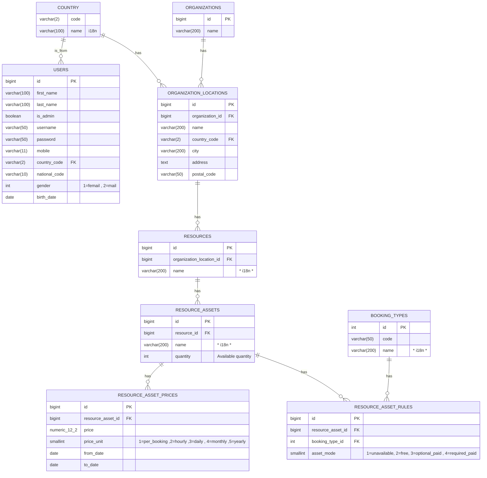

```mermaid

erDiagram

    COUNTRY{
        varchar(2) code
        varchar(100) name "i18n"
    }

    ORGANIZATIONS {
        bigint id PK
        varchar(200) name
    }

       ORGANIZATION_LOCATIONS {
        bigint id PK
        bigint organization_id FK
        varchar(200) name
        varchar(2) country_code FK
        varchar(200) city
        text address
        varchar(50) postal_code
    }

    RESOURCES {
        bigint id PK
        bigint organization_location_id FK
        varchar(200) name "* i18n *"
    }
    RESOURCE_ASSETS{
        bigint id PK
        bigint resource_id FK
        varchar(200) name "* i18n *"
        int quantity "Available quantity"

    }
    RESOURCE_ASSET_PRICES{
        bigint id PK
        bigint resource_asset_id FK
        numeric_12_2 price
        smallint price_unit " 1=per_booking ,2=hourly ,3=daily , 4=monthly ,5=yearly"
        date from_date
        date to_date
    }
    BOOKING_TYPES{
        int id PK
        varchar(50) code
        varchar(200) name "* i18n *"
    }
    RESOURCE_ASSET_RULES {
         bigint id PK
         bigint resource_asset_id FK
         int booking_type_id FK
         smallint asset_mode "1=unavailable, 2=free, 3=optional_paid , 4=required_paid "
    }
    USERS{
        bigint id PK
        varchar(100) first_name
        varchar(100) last_name
        boolean is_admin
        varchar(50) username
        varchar(50) password
        varchar(11) mobile
        varchar(2) country_code FK
        varchar(10) national_code
        int gender "1=femail , 2=mail"
        date birth_date
    }
    COUNTRY||--o{USERS :is_from
    COUNTRY||--o{ORGANIZATION_LOCATIONS :has
    ORGANIZATIONS ||--o{ORGANIZATION_LOCATIONS : has
    ORGANIZATION_LOCATIONS ||--o{ RESOURCES : has
    RESOURCES||--o{RESOURCE_ASSETS :has
    RESOURCE_ASSETS||--o{RESOURCE_ASSET_PRICES:has
    RESOURCE_ASSETS||--o{ RESOURCE_ASSET_RULES:has
     BOOKING_TYPES||--o{ RESOURCE_ASSET_RULES:has
```
